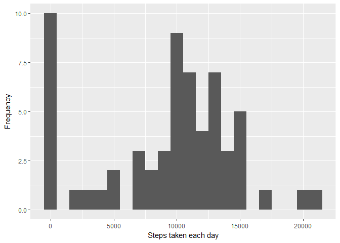
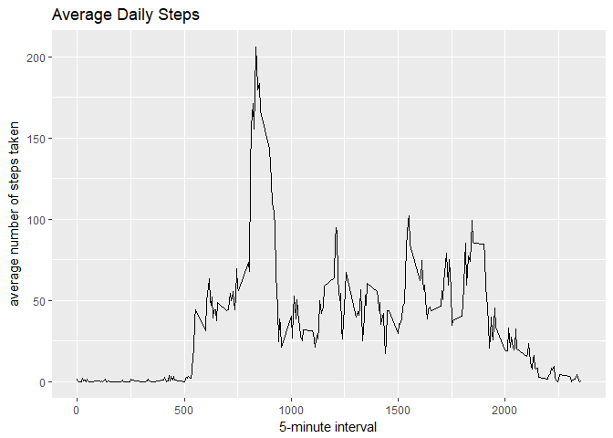
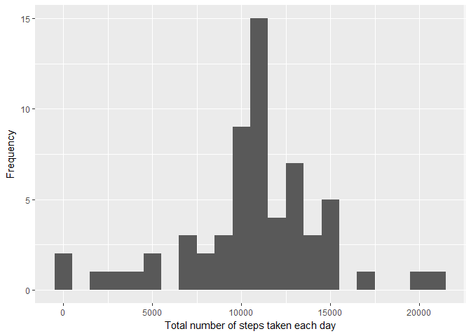
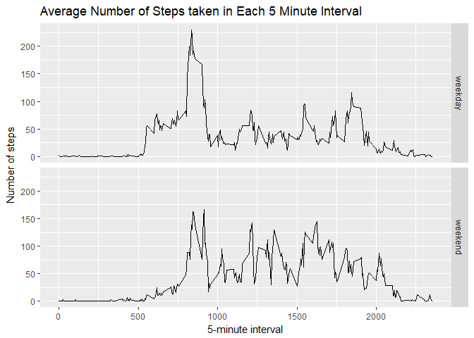

# Reproducible Research: Peer Assessment 1
This assignment makes use of data from a personal activity monitoring device. This device collects data at 5 minute intervals through out the day. The data consists of two months of data from an anonymous individual collected during the months of October and November, 2012 and include the number of steps taken in 5 minute intervals each day. 
The data for this assignment can be downloaded from the course web site: 
 Dataset: [Activity monitoring data](https://d396qusza40orc.cloudfront.net/repdata%2Fdata%2Factivity.zip) 

The variables included in this dataset are: 
steps: Number of steps taking in a 5-minute interval (missing values are coded as NA) </br> date: The date on which the measurement was taken in YYYY-MM-DD format </br> interval: Identifier for the 5-minute interval in which measurement was taken </br> The dataset is stored in a comma-separated-value (CSV) file and there are a total of 17,568 observations in this dataset. 


```r
library(ggplot2) 
```

```
## Warning: package 'ggplot2' was built under R version 3.4.2
```

## Loading and preprocessing the data

```r
unzip(zipfile="activity.zip") 
activitydata <- read.csv("activity.csv") 
```

## What is mean total number of steps taken per day?
1. Calculate the total number of steps taken per day
2. If you do not understand the difference between a histogram and a barplot, research the difference between them. 
Make a histogram of the total number of steps taken each day
3. Calculate and report the mean and median of the total number of steps taken per day


```r
stepbyday <- tapply(activitydata$steps, activitydata$date, FUN=sum, na.rm=TRUE) 
qplot(stepbyday, binwidth=1000, xlab="Steps taken each day", ylab = "Frequency")
```

<!-- -->


```r
mean(stepbyday, na.rm=TRUE) 
```

```
## [1] 9354.23
```

```r
median(stepbyday, na.rm=TRUE) 
```

```
## [1] 10395
```

## What is the average daily activity pattern?
1. Make a time series plot (i.e.type = "l") of the 5-minute interval (x-axis) and the average number of steps taken, averaged across all days (y-axis)
2. Which 5-minute interval, on average across all the days in the dataset, contains the maximum number of steps?

```r
averagestep <- aggregate(x=list(steps=activitydata$steps), by=list(interval=activitydata$interval), 
                      FUN=mean, na.rm=TRUE) 
ggplot(data=averagestep, aes(x=interval, y=steps)) + 
    geom_line() + 
    labs(title = "Average Daily Steps") +
    xlab("5-minute interval") + 
    ylab("average number of steps taken") 
```

<!-- -->


```r
averagestep[which.max(averagestep$steps),] 
```

```
##     interval    steps
## 104      835 206.1698
```

## Imputing missing values
There are many days/intervals where there are missing values (coded as `NA`). The presence of missing days may introduce bias into some calculations or summaries of the data. 

```r
missingvalues <- is.na(activitydata$steps) 
table(missingvalues) 
```

```
## missingvalues
## FALSE  TRUE 
## 15264  2304
```
All of the missing values are filled in with mean value for that 5-minute interval. 

```r
# Replace each missing value with the mean value of its 5-minute interval 
fill.value <- function(steps, interval) { 
    filled <- NA 
    if (!is.na(steps)) 
        filled <- c(steps) 
    else 

        filled <- (averagestep[averagestep$interval==interval, "steps"]) 

    return(filled) 
} 
filled.data <- activitydata

filled.data$steps <- mapply(fill.value, filled.data$steps, filled.data$interval) 
```
Using the filled data set, let's make a histogram of the total number of steps taken each day and calculate the mean and median total number of steps. 

```r
stepbyday <- tapply(filled.data$steps, filled.data$date, FUN=sum) 
qplot(stepbyday, binwidth=1000, xlab = "Total number of steps taken each day", ylab = "Frequency") 
```

<!-- -->
Mean and median values are higher after imputing missing data. The reason is that in the original data, there are some days with `steps` values `NA` for  
any `interval`. The total number of steps taken in such days are set to 0s by default. However, after replacing missing `steps` values with the mean `steps` 
of associated `interval` value, these 0 values are removed from the histogram of total number of steps taken each day. 

```r
mean(stepbyday) 
```

```
## [1] 10766.19
```

```r
median(stepbyday)
```

```
## [1] 10766.19
```

## Are there differences in activity patterns between weekdays and weekends?
1. Create a new factor variable in the dataset with two levels - "weekday" and "weekend" indicating whether a given date is a weekday or weekend day.
2. Make a panel plot containing a time series plot (i.e.type = "l" ) of the 5-minute interval (x-axis) and the average number of steps taken, averaged across all weekday days or weekend days (y-axis). See the README file in the GitHub repository to see an example of what this plot should look like using simulated data.
Find the day of the week for each measurement in the dataset. In this part, we use the dataset with the filled-in values. 

```r
weekday.or.weekend <- function(date) { 
    day <- weekdays(date) 
    if (day %in% c("Monday", "Tuesday", "Wednesday", "Thursday", "Friday")) 
        return("weekday") 
    else if (day %in% c("Saturday", "Sunday")) 
        return("weekend") 
    else 
        stop("invalid date") 
} 
filled.data$date <- as.Date(filled.data$date) 
filled.data$day <- sapply(filled.data$date, FUN=weekday.or.weekend) 
```
Make a panel plot containing plots of average number of steps taken on weekdays and weekends. 

```r
averagestep <- aggregate(steps ~ interval + day, data=filled.data, mean) 
ggplot(averagestep, aes(interval, steps)) + geom_line() + facet_grid(day ~ .) + 
  labs(title = "Average Number of Steps taken in Each 5 Minute Interval")+
    xlab("5-minute interval") + ylab("Number of steps") 
```

<!-- -->


